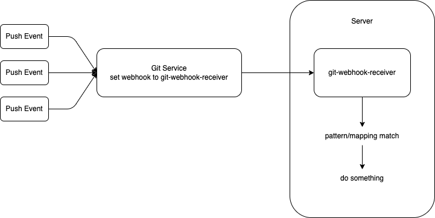

# git-webhook-receiver



## About
The idea of this project is to handle notifications from the git service (webhook from Github/Gitlab/Bitbucket) and make another command to be executed on our server. I know there are some tools such as Jenkins, CircleCI, GitLab CI/CD and Drone that also handle this job and maybe they have multiple features that do not cover with git-webhook-receiver. but it's ok, I only need something like binary to run (that why I write this project in Go), lightweight, self-host, and easily use json config to map what changes in whitelisted branches and the trigger action.

## Installation
```
$ cp config.json.example config.json
$ echo 'you can adjust the json config as you want' && nano config.json
$ go run app/main/main.go

or if the binary is ready you can just do
$ ./git-webhook-receiver
```

remember that config file should be in the similar folder if you running this app

## Other
- [Postman collection](https://documenter.getpostman.com/view/1806312/2s93si1VgX)
